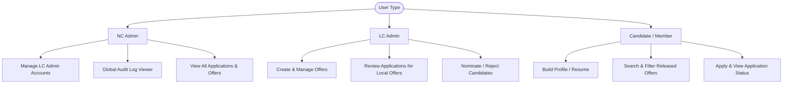

# IAESTE India Portal — Offer Management Platform

An end-to-end full-stack web application built to streamline international internship offer distribution, candidate profiling, application tracking, and administrative nomination workflows across different Local Committees (LCs) under IAESTE India.

---

## 🚀 Key Features

*   **Role-Based Access Control (RBAC):** Tailored views and permissions for National Committee Admins (`NC_ADMIN`), Local Committee Admins (`LC_ADMIN`), and Candidates (`MEMBER`).
*   **Resume Builder:** A rich, step-by-step profile generator allowing candidates to list education, work experience, projects, skills, languages, and certifications.
*   **Offer Management System:** LC Admins can draft, publish, and close internship offers. Offers can be restricted to specific LCs or released globally.
*   **Application & Nomination Workflow:** Candidates apply to offers with a frozen snapshot of their resume. Admins track, review, and nominate applicants through a structured pipeline.
*   **Automated Audit Logging:** Logs major system actions (offer releases, applications, final selections) to maintain compliance and transparency.
*   **Database Seeding:** Automatically seeds default administrators (`NC_ADMIN` and `LC_ADMIN` for major committees) on initial database connection.

---

## 🛠️ Technology Stack

| Component | Technology | Description |
| :--- | :--- | :--- |
| **Frontend** | React (Vite) | Single Page Application framework with HMR |
| **Styling** | Vanilla CSS | Custom, responsive UI with modern CSS variables and flexbox |
| **Routing** | React Router Dom | Client-side routing with route guards |
| **State** | Context API | Core authentication & session management |
| **Backend** | Node.js + Express.js | RESTful API server with ES Modules |
| **Database** | MongoDB + Mongoose | Document-oriented storage |
| **Security** | JWT + BcryptJS | Token-based sessions & hashed credentials |
| **Task Runner** | Concurrently | Simulates multi-service startup during development |

---

## 📂 Project Directory Structure

```text
iaeste-india-portal/
├── backend/
│   ├── middleware/        # JWT validation & role restriction guards
│   ├── models/            # Mongoose schemas (User, Offer, Application, AuditLog)
│   ├── routes/            # REST API endpoint handlers
│   └── server.js          # Express app setup, DB connection, and user seeding
├── frontend/
│   ├── src/
│   │   ├── components/    # Reusable UI widgets (Navbar, ResumePreview)
│   │   ├── context/       # AuthContext for auth operations and fetch requests
│   │   ├── pages/         # Page components (Dashboard, Resume, Admin lists)
│   │   ├── App.jsx        # Routing configuration and role protections
│   │   └── index.css      # Core style definitions and design system
│   ├── package.json       # Frontend dependencies and dev scripts
│   └── vite.config.js     # Vite configuration
├── .env                   # Root environment configuration (Git-ignored)
└── package.json           # Root scripts to run client & server concurrently
```

---

## 🔐 Environment Configuration

Create a `.env` file in the root directory and configure the following variables:

```env
# Server Port (Default: 5000)
PORT=5000

# MongoDB URI (Atlas Connection String or Local URI)
MONGODB_URI=mongodb+srv://<username>:<password>@cluster.xxxxxx.mongodb.net/iaeste_india

# JSON Web Token Secret Key
JWT_SECRET=your_super_secure_jwt_secret_key_here

# Allowed CORS origins (Comma-separated list)
CORS_ORIGINS=http://localhost:5173,https://your-frontend.vercel.app
```

> [!NOTE]
> If `MONGODB_URI` fails to connect to MongoDB Atlas, the backend automatically attempts to fall back to a local MongoDB instance running at `mongodb://localhost:27017/iaeste_india`.

---

## 👥 Access Matrix & Roles



### Roles Breakdown:
1.  **NC Admin (`NC_ADMIN`):**
    *   Creates/deletes `LC_ADMIN` accounts.
    *   Monitors all activities across all local committees.
    *   Has full read permissions for all applications and offers.
2.  **LC Admin (`LC_ADMIN`):**
    *   Represents a Local Committee (e.g., `MU`, `MUJ`, `KU`, `JECRC`).
    *   Maintains a list of internship offers targeted specifically to their committee or released globally.
    *   Reviews, updates application status (`APPLIED` ➔ `REVIEWING` ➔ `NOMINATED` / `ACCEPTED` / `REJECTED`).
3.  **Member / Candidate (`MEMBER`):**
    *   Represents a student looking for internships.
    *   Must complete their Resume profile before submitting applications.
    *   Submits applications which capture a frozen resume snapshot.

---

## ⚡ Setup & Installation

### 1. Prerequisites
Ensure you have the following installed on your machine:
*   [Node.js](https://nodejs.org/) (v16.x or higher recommended)
*   [MongoDB](https://www.mongodb.com/try/download/community) (either a running local instance or a MongoDB Atlas account)

### 2. Install Dependencies
Run the following command in the **root** folder to install dependencies for the root orchestrator:
```bash
npm install
```

Then install the frontend-specific dependencies:
```bash
cd frontend
npm install
cd ..
```

### 3. Run the Development Servers
You can run both the Express backend server and the Vite React frontend client concurrently from the root directory:
```bash
npm run dev
```
*   **Backend Server:** Runs on [http://localhost:5000](http://localhost:5000)
*   **Frontend Client:** Runs on [http://localhost:5173](http://localhost:5173)

---

## 🔑 Default Seeded Credentials

When the backend runs for the first time and successfully connects to the database, it automatically generates several administrative accounts. 

> [!IMPORTANT]
> The default password for all seeded accounts is **`admin123`**. Admins will be requested to reset their password upon initial login if forced to do so.

*   **National Committee (NC) Admin:**
    *   **Email:** `ncadmin@iaeste.in`
*   **Local Committee (LC) Admins:**
    *   **LC MU:** `muadmin@iaeste.in`
    *   **LC MUJ:** `mujadmin@iaeste.in`
    *   **LC KU:** `kuadmin@iaeste.in`
    *   **LC JECRC:** `jecrcadmin@iaeste.in`

---

## 🔄 Core Workflows

### Offer State Transitions
```text
[ DRAFT ]  ──────── (Release Offer) ───────➔  [ RELEASED ]
    │                                              │
    └── (Cancel/Archived)                          └── (Nominee selected & offer closed)
            │                                              │
            ▼                                              ▼
       [ CLOSED ] ◄────────────────────────────────────────┘
```

### Application Lifecycle Status
When a candidate applies to an offer, the application flows through the following states:
1.  **`APPLIED`:** The application is submitted. A snapshot of the candidate's current resume is stored within the application document.
2.  **`REVIEWING`:** The LC Admin has opened the candidate's application and is checking their eligibility.
3.  **`NOMINATED`:** The candidate has been selected by their LC to be presented to the international employer.
4.  **`ACCEPTED` / `REJECTED`:** The candidate is accepted or rejected by the receiving country.
5.  **`SELECTED` / `NOT_SELECTED`:** The final status indicating whether the candidate has completed the exchange.

---

## 📡 API Endpoints

### 🗝️ Authentication (`/api/auth`)
*   `POST /api/auth/register` — Registers a new Candidate (`MEMBER`).
*   `POST /api/auth/login` — Authenticates user, returns JWT in payload.
*   `GET /api/auth/me` — Fetches current user session profile.
*   `PUT /api/auth/reset-password` — Resets temporary passwords.

### 💼 Offers (`/api/offers`)
*   `GET /api/offers` — Returns offers based on roles (Members see only `RELEASED` offers; LC admins see their drafts).
*   `POST /api/offers` — Creates a new offer (`LC_ADMIN` only).
*   `PUT /api/offers/:id` — Edits an offer.
*   `DELETE /api/offers/:id` — Deletes an offer.
*   `POST /api/offers/:id/release` — Releases a draft offer to candidates.

### 📝 Applications (`/api/applications`)
*   `POST /api/applications` — Candidate applies to an offer.
*   `GET /api/applications/my-applications` — Candidate retrieves their own list of applications.
*   `GET /api/applications` — Admins retrieve application lists (filtered by LC for `LC_ADMIN`).
*   `PUT /api/applications/:id/status` — Updates application workflow status.

### 👑 NC Admin Actions (`/api/members`)
*   `GET /api/members` — NC Admin lists all LC Admins, Staff, and Members.
*   `POST /api/members` — NC Admin creates a new committee user (generating a temporary password).
*   `DELETE /api/members/:id` — NC Admin deletes a committee user.
